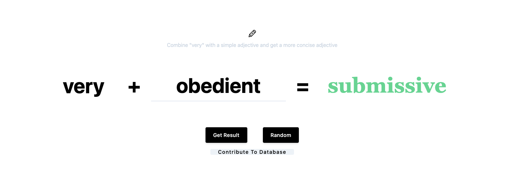

# NoMoreVery

 
 
Combine "very" with a simple adjective to get a more concise adjective 🏆

👉 Check out the [live demo](https://no-more-very.ishaantek.com)

This project was made for my 7th grade English teacher, who hated students using the word "very" in their writing. If you are a writer struggling with this, this website should be "very helpful" for you!

Made by [Ishaan Garg](https://twitter.com/ishaantek)

[comment]: <> (Product Hunt)

## Table of contents
- [No More Very](#NoMoreVery)
  - [Table of contents](#table-of-contents)
  - [Self-hosting NoMoreVery](#self-hosting-nomorevery)
  - [Libraries used](#libraries-used)

## Self-hosting NoMoreVery
You can run NoMoreVery locally on your computer.

1. Download the code. In the web version of GitHub, you can do that by clicking the green "Code" button, and then "Download ZIP".
2. Unzip it, and open it in code.
3. Open the `index.html` file to start the website in a live server.

## Libraries used

- [Vanilla JS](http://vanilla-js.com/) - to create the functionality for the website.
#

Feel free to reach out to me through email at ishaan@ishaantek.com or [on Twitter](https://twitter.com/ishaantek) if you have any questions or feedback! Hope you find this useful 💙
